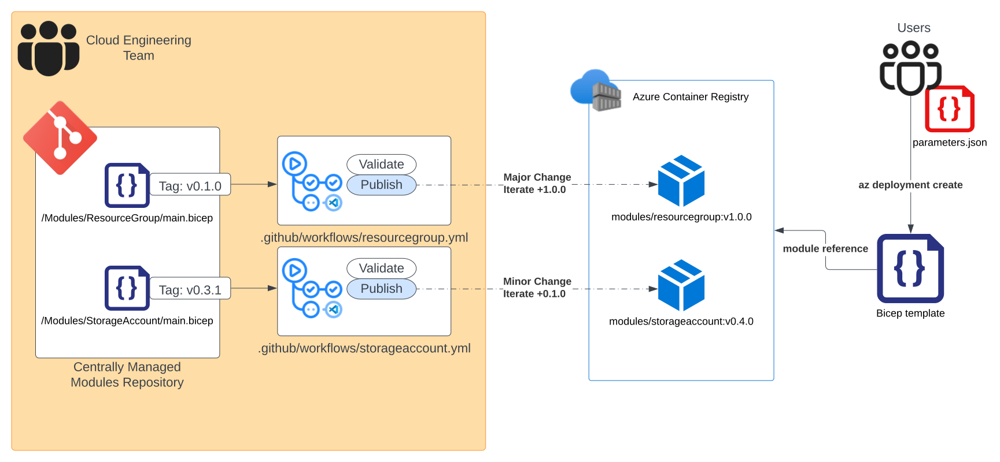

# Common Azure Resource Module Library - Bicep Demo

## Description

This repository includes a CI platform for and collection of curated DEMO [Bicep][Bicep] modules.
The platform supports both ARM and Bicep and can be leveraged using GitHub actions as well as Azure DevOps pipelines.

## Status

## Consumption Model

Above diagram outlines the high-level overview of how the structure outlined in this repository is aiming to be consumed.

* **Cloud Engineering Team** - Team dedicated to maintaining the repository, and providing training to the consuming parties to properly leverage this structure. 
* **Centrally Managed Modules Repository** - *this* repository, contains the Bicep module and pipeline definitions, as well as the relevant documentation to ensure all consuming parties are made aware of new releases and standards, and how to introduce new changes through a workflow such as GitHub issues. 
* **Azure Container Registry** - This sturcture relies on Azure Container Registry (ACR) as its private-registry, but this component can be replaced with any other private-registry that supports universal packages.
* **Users** - Consuming parties that will rely on the centralized private registry to pull in pre-defined templates to deploy their infrastructure as code.

## Available Resource Modules

| Name | Status |
| - | - |
| [Key Vaults](https://github.com/JinLee794/BicepModulesDemo/tree/main/arm/Microsoft.KeyVault/vaults) |  |
| [Network Security Groups](https://github.com/JinLee794/BicepModulesDemo/tree/main/arm/Microsoft.Network/networkSecurityGroups) |  |
| [Resource Groups](https://github.com/JinLee794/BicepModulesDemo/tree/main/arm/Microsoft.Resources/resourceGroups) |  |
| [Resources Tags](https://github.com/JinLee794/BicepModulesDemo/tree/main/arm/Microsoft.Resources/tags) |  |
| [Role Assignments](https://github.com/JinLee794/BicepModulesDemo/tree/main/arm/Microsoft.Authorization/roleAssignments) |  |
| [Role Definitions](https://github.com/JinLee794/BicepModulesDemo/tree/main/arm/Microsoft.Authorization/roleDefinitions) |  |
| [Storage Accounts](https://github.com/JinLee794/BicepModulesDemo/tree/main/arm/Microsoft.Storage/storageAccounts) |  |
| [Virtual Networks](https://github.com/JinLee794/BicepModulesDemo/tree/main/arm/Microsoft.Network/virtualNetworks) |  |

## Contributing

This project welcomes contributions and suggestions.  Most contributions require you to agree to a Contributor License Agreement (CLA) declaring that you have the right to, and actually do, grant us the rights to use your contribution. For details, visit <https://cla.opensource.microsoft.com>.

When you submit a pull request, a CLA bot will automatically determine whether you need to provide a CLA and decorate the PR appropriately (e.g., status check, comment). Simply follow the instructions provided by the bot. You will only need to do this once across all repos using our CLA.

This project has adopted the [Microsoft Open Source Code of Conduct](https://opensource.microsoft.com/codeofconduct/).
For more information see the [Code of Conduct FAQ](https://opensource.microsoft.com/codeofconduct/faq/) or contact [opencode@microsoft.com](mailto:opencode@microsoft.com) with any additional questions or comments.

## Trademarks

This project may contain trademarks or logos for projects, products, or services. Authorized use of Microsoft trademarks or logos is subject to and must follow
[Microsoft's Trademark & Brand Guidelines](https://www.microsoft.com/en-us/legal/intellectualproperty/trademarks/usage/general).
Use of Microsoft trademarks or logos in modified versions of this project must not cause confusion or imply Microsoft sponsorship.
Any use of third-party trademarks or logos are subject to those third-party's policies.

## Learn More

* [PowerShell Documentation][PowerShellDocs]
* [Microsoft Azure Documentation][MicrosoftAzureDocs]
* [GitHubDocs][GitHubDocs]
* [Azure Resource Manager][AzureResourceManager]
* [Bicep][Bicep]

<!-- References -->

<!-- Local -->
[Wiki]: <https://github.com/JinLee794/Modules/wiki>
[ProjectSetup]: <https://docs.github.com/en/communities/setting-up-your-project-for-healthy-contributions>
[GitHubDocs]: <https://docs.github.com/>
[AzureDevOpsDocs]: <https://docs.microsoft.com/en-us/JinLee794/devops/?view=azure-devops>
[GitHubIssues]: <https://github.com/JinLee794/Modules/issues>
[Contributing]: CONTRIBUTING.md
[AzureIcon]: docs/media/MicrosoftAzure-32px.png
[PowershellIcon]: docs/media/MicrosoftPowerShellCore-32px.png
[BashIcon]: docs/media/Bash_Logo_black_and_white_icon_only-32px.svg.png
[ArchOviewview]: docs/media/GH_Actions_Bicep_Flow.png

<!-- External -->
[Bicep]: <https://github.com/Azure/bicep>
[Az]: <https://img.shields.io/powershellgallery/v/Az.svg?style=flat-square&label=Az>
[AzGallery]: <https://www.powershellgallery.com/packages/Az/>
[PowerShellCore]: <https://github.com/PowerShell/PowerShell/releases/latest>
[InstallAzPs]: <https://docs.microsoft.com/en-us/powershell/Azure/install-az-ps>
[AzureResourceManager]: <https://docs.microsoft.com/en-us/Azure/azure-resource-manager/management/overview>
[TemplateSpecs]: <https://docs.microsoft.com/en-us/Azure/azure-resource-manager/templates/template-specs>

[ESLZ]: <https://github.com/Azure/Enterprise-Scale>
[AzureSecurityBenchmark]: <https://docs.microsoft.com/en-us/Azure/cloud-adoption-framework/ready/enterprise-scale/security-governance-and-compliance#azure-security-benchmark>
[ESLZWorkloadTemplatesLibrary]: <https://github.com/Azure/Enterprise-Scale/tree/main/workloads>

<!-- Docs -->
[MicrosoftAzureDocs]: <https://docs.microsoft.com/en-us/Azure/>
[PowerShellDocs]: <https://docs.microsoft.com/en-us/powershell/>
