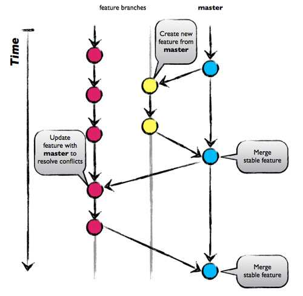

<!-- START doctoc generated TOC please keep comment here to allow auto update -->
<!-- DON'T EDIT THIS SECTION, INSTEAD RE-RUN doctoc TO UPDATE -->
## _Navigation_

- [Branching Strategies](#branching-strategies)
  - [GitFlow](#gitflow)
    - [Git Flow Pros and Cons](#git-flow-pros-and-cons)
  - [GitHub Flow](#github-flow)
    - [GitHub Flow Pros and Cons](#github-flow-pros-and-cons)
  - [GitLab Flow](#gitlab-flow)
  - [Trunk Based Development](#trunk-based-development)
    - [Trunk-based Development Pros and Cons](#trunk-based-development-pros-and-cons)
  - [How to choose the best branching strategy for your team](#how-to-choose-the-best-branching-strategy-for-your-team)

<!-- END doctoc generated TOC please keep comment here to allow auto update -->

# Branching Strategies

In modern software development, speed and agility are crucial when it comes to developing and releasing software. However, when you have a large team of developers working simultaneously, branching and merging code can become messy fast. 

Therefore, teams need to have a process in place to implement multiple changes at once. This is where having an efficient branching strategy becomes a priority for these teams.

>Document originated from [flagship.io: git branching strategies](https://www.flagship.io/git-branching-strategies/)

## GitFlow

Considered to be a bit complicated and advanced for many of today’s projects, [GitFlow](https://nvie.com/posts/a-successful-git-branching-model/) enables parallel development where developers can work separately from the master branch on features where a feature branch is created from the master branch.

Afterwards, when changes are complete, the developer merges these changes back to the master branch for release.

This branching strategy consists of the following branches:

- Master
- Develop
- Feature- to develop new features that branches off the develop branch
- Release- help prepare a new production release; usually branched from the develop branch and must be merged back to both develop and master
- Hotfix- also helps prepare for a release but unlike release branches, hotfix branches arise from a bug that has been discovered and must be resolved; it enables developers to keep working on their own changes on the develop branch while the bug is being fixed.

The main and develop branches are considered to be the main branches, with an infinite lifetime, while the rest are supporting branches that are meant to aid parallel development among developers, usually short-lived.

### Git Flow Pros and Cons

Perhaps the most obvious benefit of this model is that it allows for parallel development to protect the production code so the main branch remains stable for release while developers work on separate branches.

Moreover, the various types of branches make it easier for developers to organize their work. This strategy contains separate and straightforward branches for specific purposes though for that reason it may become complicated for many use cases. 

It is also ideal when handling multiple versions of the production code.

However, as more branches are added, they may become difficult to manage as developers merge their changes from the development branch to the main. Developers will first need to create the release branch then make sure any final work is also merged back into the development branch and then that release branch will need to be merged into the main branch.

In the event that changes are tested and the test fails, it would become increasingly difficult to figure out where the issue is exactly as developers are lost in a sea of commits.

Indeed, due to GitFlow’s complexity, it could slow down the development process and release cycle. In that sense, GitFlow is not an efficient approach for teams wanting to implement continuous integration and continuous delivery. 

Thus, in that case a much simpler workflow such as GitHub Flow is recommended.

More about GitFlow [here](./GitFlow.md)

## GitHub Flow

Unlike GitFlow, this model doesn’t have release branches. You start off with the `main` branch then developers create branches, feature branches that stem directly from the master, to isolate their work which are then merged back into `main`. The feature branch is then deleted.

The main idea behind this model is keeping the master code in a constant deployable state and hence can support continuous integration and continuous delivery processes.

### GitHub Flow Pros and Cons

Github Flow focuses on Agile principles and so it is a fast and streamlined branching strategy with short production cycles and frequent releases. 

This strategy also allows for fast feedback loops so that teams can quickly identify issues and resolve them.

Since there is no development branch as you are testing and automating changes to one branch which allows for quick and continuous deployment.

This strategy is particularly suited for small teams and web applications and it is ideal when you need to maintain a single production version.

Thus, this strategy is not suitable for handling multiple versions of the code.

Furthermore, the lack of development branches makes this strategy more susceptible to bugs and so can lead to an unstable production code if branches are not properly tested before merging with the master-release preparation and bug fixes happen in this branch. The master branch, as a result, can become cluttered more easily as it serves as both a production and development branch.

A further disadvantage is as this model is more suited to small teams and hence, as teams grow merge conflicts can occur as everyone is merging to the same branch and there is a lack of transparency meaning developers cannot see what other developers are working on.

## GitLab Flow

[GitLab Flow](https://docs.gitlab.com/ee/topics/gitlab_flow.html) is a simpler alternative to GitFlow that combines feature-driven development and feature branching with issue tracking.

With GitFlow, developers create a develop branch and make that the default while GitLab Flow works with the main branch right away.

GitLab Flow is great when you want to maintain multiple environments and when you prefer to have a [staging environment](https://www.flagship.io/test-environment/) separate from the production environment. Then, whenever the main branch is ready to be deployed, you can merge back into the production branch and release it.

Thus, this strategy offers propers isolation between environments allowing developers to maintain several versions of software in different environments.

While GitHub Flow assumes that you can deploy into production whenever you merge a feature branch into the master, GitLab Flow seeks to resolve that issue by allowing the code to pass through internal environments before it reaches production, as seen in the image below.

Therefore, this method is suited for situations where you don’t control the timing of the release, such as an iOS app that needs to go through the App store validation first or when you have specific deployment windows.

## Trunk Based Development

Trunk-based development is a branching strategy that in fact requires no branches but instead, developers integrate their changes into a shared trunk at least once a day. This shared trunk should be ready for release anytime.

The main idea behind this strategy is that developers make smaller changes more frequently and thus the goal is to limit long-lasting branches and avoid merge conflicts as all developers work on the same branch. In other words, developers commit directly into the trunk without the use of branches.

Consequently, trunk-based development is a key enabler of continuous integration (CI) and continuous delivery (CD)  since changes are done more frequently to the trunk, often multiple times a day (CI) which allows features to be released much faster (CD).

This strategy is often combined with feature flags. As the trunk is always kept ready for release, feature flags help decouple deployment from release so any changes that are not ready can be wrapped in a feature flag and kept hidden while features that are complete can be released to end-users without delay.

### Trunk-based Development Pros and Cons

As we’ve seen, trunk-based development paves the way for continuous integration as the trunk is kept constantly updated.

It also enhances collaboration as developers have better visibility over what changes other developers are making as commits are made directly into the trunk without the need for branches. This is unlike other branching methods where each developer works independently in their own branch and any changes that occur in that branch can only be seen after merging into the main branch.

Because trunk-based development does not require branches, this eliminates the stress of long-lived branches and hence, merge conflicts or the so-called ‘merge hell’ as developers are pushing small changes much more often. This also makes it easier to resolve any conflicts that may arise.

Finally, this strategy allows for quicker releases as the shared trunk is kept in a constant releasable state with a continuous stream of work being integrated into the trunk which results in a more stable release.

However, this strategy is suited to more senior developers as this strategy offers a great amount of autonomy which non-experienced developers might find daunting as they are interacting directly with the shared trunk. Thus, for a more junior team whose work you may need to monitor closely, you may opt for a Git branching strategy.

More about Trunk Based Development [here](https://trunkbaseddevelopment.com/)

## How to choose the best branching strategy for your team

When first starting out, it’s best to keep things simple and so initially GitHub Flow or Trunk-based development may work best. They are also ideal for smaller teams requiring only a single version of a release to be maintained. 

GitFlow is great for open-source projects that require strict access control to changes. This is especially important as open-source projects allow anyone to contribute and so with Git Flow, you can check what is being introduced into the source code.

However, GitFlow, as previously mentioned, is not suitable when wanting to implement a DevOps environment. In this case, the other strategies discussed are a better fit for an Agile DevOps process and to support your CI and CD pipeline.

The following table summarizes the strategies discussed in this article and which strategy is appropriate in which context:

| Product type and its release method | Team size | Collaboration maturity | Applicable mainstream branch mode |
| --- | --- | --- | --- |
| All | Small team | High | Trunk-Based Development (TBD) |
| Products that support continuous deployment and release, such as SaaS products | Middle | Moderate | GitHub-Flow and TBD |
| Products with a definite release window and a periodic version release cadence, such as iOS apps | Middle | Moderate | Git-Flow and GitLab-Flow with release branch |
| Products that are demanding for product quality and support continuous deployment and release, such as basic platform products | Middle | Moderate | GitLab-Flow |
| Products that are demanding for product quality and have a long maintenance cycle for released versions, such as 2B basic platform products | Large | Moderate | Git-Flow |