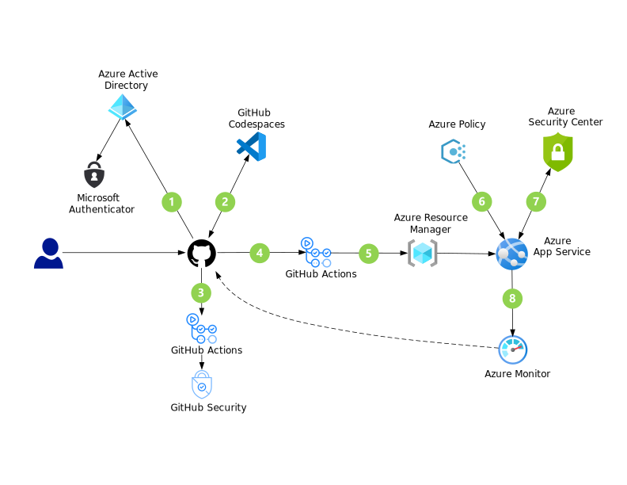
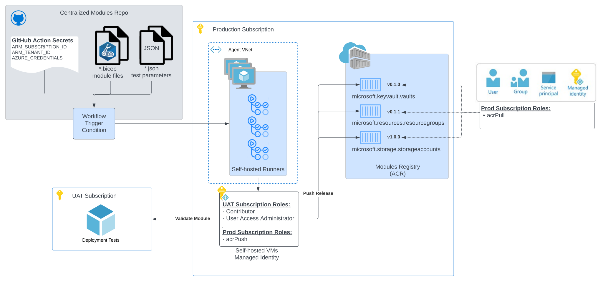

# Securing Environment

---

## _Navigation_

- [DevSecOps in GitHub](#devsecops-in-github)
  - [**Potential use cases**](#--potential-use-cases--)
- [Security in Azure Infrastructure](#security-in-azure-infrastructure)
  - [Self-Hosted Runners](#self-hosted-runners)
- [Further Reading](#further-reading)

---

## DevSecOps in GitHub

[DevSecOps](https://docs.microsoft.com/en-us/azure/architecture/solution-ideas/articles/devsecops-in-github)
 adheres to security best practices by adopting a [shift-left](https://devops.com/devops-shift-left-avoid-failure/) strategy that focuses on quality and proactive measures to prevent problems instead of relying on detection.

### **Potential use cases**

GitHub DevSecOps installations cover many security scenarios. Possibilities include the following cases:

- Developers who want to take advantage of pre-configured environments that offer security capabilities.
- Administrators who rely on having up-to-date, prioritized security reports at their fingertips, along with details on affected code and suggested fixes.
- Streamlined organizations that need systems to automatically acquire new, uncompromised security devices when secrets are left exposed in code.
- Development teams that could benefit from automatic upgrades when newer or more secure versions of external packages become available.

1. When developers access GitHub resources, GitHub redirects them to Azure Active Directory (Azure AD) for SAML authentication. In a single sign-on (SSO) procedure, the [Microsoft Authenticator app](https://docs.microsoft.com/en-us/azure/active-directory/user-help/user-help-auth-app-overview) then uses FIDO2 strong authentication. The passwordless [FIDO2 security keys](https://docs.microsoft.com/en-us/azure/active-directory/authentication/concept-authentication-passwordless#fido2-security-keys) align with the latest [Fast Identity Online (FIDO) Alliance](https://fidoalliance.org/) specifications.
2. Developers begin working on tasks in Codespaces. Organized into containers, these pre-built development environments provide correctly configured IDEs that are equipped with required security scanning extensions.
3. When developers commit new code, GitHub Actions automatically scan the code to quickly find vulnerabilities and coding errors.
4. Pull requests (PRs) trigger code builds and automated testing through GitHub Actions. GitHub encrypts secrets and credentials at rest and obfuscates these entries in logs.
5. GitHub Actions deploy build artifacts to Azure App Service while making changes to other cloud resources, such as service endpoints.
6. Azure Policy evaluates Azure resources that are in deployment. Defined policies then potentially deny releases, modify cloud resources, or create warning events in activity logs.
7. Microsoft Defender for Cloud identifies attacks targeting applications that are running in deployed projects.
8. Azure Monitor continuously tracks and evaluates app behavior. When threats materialize, this service sends alerts to start the process of rolling code back to previous commits.

## Security in Azure Infrastructure

For elevated control over your workflows, you can leverage [Self-Hosted Runners](#self-hosted-runners) with Azure RBAC to run your workflows within Azure.

### Self-Hosted Runners

A self-hosted runner is a system that you deploy and manage to execute jobs from GitHub Actions on GitHub.com. For more information about GitHub Actions, see ["Understanding GitHub Actions."](https://docs.github.com/en/actions/learn-github-actions/understanding-github-actions)

Self-hosted runners offer more control of hardware, operating system, and software tools than GitHub-hosted runners provide. With self-hosted runners, you can create custom hardware configurations that meet your needs with processing power or memory to run larger jobs, install software available on your local network, and choose an operating system not offered by GitHub-hosted runners. Self-hosted runners can be physical, virtual, in a container, on-premises, or in a cloud.

You can add self-hosted runners at various levels in the management hierarchy on GitHub:

- Repository-level runners are dedicated to a single repository.
- Organization-level runners can process jobs for multiple repositories in an organization.
- Enterprise-level runners can be assigned to multiple organizations in an enterprise account.

The above chart displays a possible implementation of self-hosted runners within an Azure environment.

- GitHub Actions workflows retrieves secrets from [GitHub Secrets](https://github.com/Azure/actions-workflow-samples/blob/master/assets/create-secrets-for-GitHub-workflows.md) to ensure that the workflow targets the appropriate scope (management group, subscription, resource group) for each run.
  - Access to secrets can be managed fully through GitHub, and set at an organization, team, or repo level.
- Once a workflow trigger condition is met (such as on push to main), the operations defined on the `.yml` configuration will execute within the [agents](https://github.com/actions/runner) that are installed on the virtual machines hosted within the `Agent VNet`.
- The virtual machines running the workflow will then use the [managed identity](https://docs.microsoft.com/en-us/azure/active-directory/managed-identities-azure-resources/overview) associated with the virtual machine to:
  - run the deployment tests within the UAT environment
  - publish a new release into the ACR
- The `Contributor` and `User Access Administrator` roles over the UAT subscription allows the managed identity autonomy when running live deployment tests for each module and its dependencies in the configured scenarios provided by the `.parameters` directory.
- The `acrPush` role assigned to the managed identity will grant access to publish new modules into the [Azure Container Registry](https://docs.microsoft.com/en-us/azure/container-registry/#:~:text=Azure%20Container%20Registry%20allows%20you,container%20development%20and%20deployment%20pipelines.)
- You can make your content within the ACR [publicly available](https://docs.microsoft.com/en-us/azure/container-registry/anonymous-pull-access) for pull operations, or grant selective users/groups/service identities `acrPull` access.

## Further Reading

[DevSecOps in GitHub - Azure Solution Ideas](https://docs.microsoft.com/en-us/azure/architecture/solution-ideas/articles/devsecops-in-github)
[GitHub Actions Runner Repo](https://github.com/actions/runner)
[Using self-hosted runners in a workflow - GitHub Docs](https://docs.github.com/en/actions/hosting-your-own-runners/using-self-hosted-runners-in-a-workflow)
[GitHub - Azure/login: Connect to Azure](https://github.com/Azure/login)
[Managing access to self-hosted runners using groups - GitHub Docs](https://docs.github.com/en/actions/hosting-your-own-runners/managing-access-to-self-hosted-runners-using-groups)
[Security hardening for GitHub Actions - GitHub Docs](https://docs.github.com/en/actions/security-guides/security-hardening-for-github-actions)
